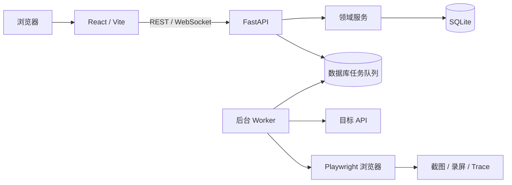

# 测试管理平台

一个面向测试团队的全流程质量协作平台，统一管理功能用例、接口用例、UI 自动化用例、执行记录、XMind 用例生成、人员及角色权限。

项目采用前后端分离架构：前端基于 React 与 Ant Design，后端基于 FastAPI 与 SQLAlchemy，默认使用 SQLite 持久化数据，并内置自动化任务 Worker。

## 功能概览

| 模块 | 主要能力 |
| --- | --- |
| 仪表盘 | 用例总量与类型分布、最近用例、快捷操作入口 |
| 测试用例 | 功能、接口和 UI 三类用例的筛选、分页、创建、编辑、删除与模块管理 |
| 文件导入导出 | 功能用例 CSV/XLSX 导入导出、标准模板下载、Apifox 数据导入 |
| 接口自动化 | 请求参数、请求头、请求体、断言与变量提取配置，支持单用例调试和批量执行 |
| UI 自动化 | 浏览器步骤、环境、超时和重试配置，支持 Playwright 调试、批量执行与产物回看 |
| XMind 生成 | XMind 解析、异步 AI 生成、任务重试/取消、人工审核、入库与导出 |
| 执行中心 | UI/API 任务入队、中断、实时进度、执行明细与报告 |
| 人员与权限 | 用户注册、启停、删除，以及角色权限矩阵维护 |
| 平台设置 | 执行环境、超时重试、Webhook、AI 服务与个人资料配置 |
| 账号认证 | 登录、登出、资料修改、密码变更及会话失效 |

## 技术栈

- 前端：React 18、TypeScript 5、Vite 7、Ant Design 6、React Router、Recharts
- 后端：Python 3.12、FastAPI、SQLAlchemy 2、Alembic、Pydantic
- 数据与文件：SQLite、OpenPyXL、XLRD
- 自动化：Playwright、JSONPath、后台任务 Worker、WebSocket
- 质量检查：TypeScript、Vitest、Testing Library、Pytest、Playwright E2E

## 快速开始

### 环境要求

- Python 3.12+
- Node.js 22.12+ 与 npm 10+
- Git

### 1. 获取代码

```bash
git clone https://github.com/Alin1013/test-platform.git
cd test-platform
```

### 2. 启动后端

在项目根目录执行：

```bash
python3 -m venv .venv
source .venv/bin/activate
pip install -r requirements.txt
alembic upgrade head
uvicorn backend.app.main:app --reload --port 8000
```

后端启动时会幂等初始化演示数据，并在同一进程中启动任务 Worker。服务入口如下：

- 健康检查：<http://127.0.0.1:8000/health>
- Swagger API 文档：<http://127.0.0.1:8000/docs>
- ReDoc API 文档：<http://127.0.0.1:8000/redoc>

需要执行 UI 自动化时，再安装所需浏览器：

```bash
playwright install chromium firefox webkit
```

### 3. 启动前端

新开一个终端，在项目根目录执行：

```bash
cd frontend
npm ci
cp .env.example .env
npm run dev -- --host 127.0.0.1
```

打开 <http://127.0.0.1:56789>，使用演示账号登录：

```text
账号：jiangshan
密码：Test1234
```

> 演示账号仅用于本地开发。部署前请修改密码或禁用该账号，并重新配置系统设置中的执行环境与 AI 密钥。

## 系统架构



前端页面通过统一的 `PlatformService` 访问后端。开发环境下，Vite 会把 `/api` 和 `/uploads` 代理到 `http://127.0.0.1:8000`；后端负责路由装配、业务校验、数据库访问、任务入队和执行状态推送，Worker 负责消费 API、UI 与 XMind 生成任务。

## 项目结构

```text
test-platform/
├── backend/
│   ├── app/
│   │   ├── routers/              # FastAPI 路由
│   │   ├── services/             # 领域服务与任务执行器
│   │   ├── models.py             # SQLAlchemy 数据模型
│   │   ├── schemas.py            # 通用请求与响应模型
│   │   ├── main.py               # 应用装配与后台 Worker 启动
│   │   └── worker.py             # 独立 Worker 入口
│   └── migrations/               # Alembic 数据库迁移
├── frontend/
│   ├── e2e/                      # Playwright 端到端测试
│   ├── public/                   # 公共静态资源
│   └── src/
│       ├── app/                  # 路由、布局与全局 Provider
│       ├── components/           # 通用组件
│       ├── pages/                # 各业务页面
│       ├── services/             # API 客户端、认证与领域契约
│       ├── styles/               # 全局样式与设计变量
│       └── main.tsx              # 前端入口
├── alembic.ini                   # 数据库迁移配置
├── requirements.txt              # Python 依赖
└── README.md
```

## 页面路由

| 路由 | 页面 |
| --- | --- |
| `/login` | 登录与账号注册 |
| `/dashboard` | 仪表盘 |
| `/test-cases/functional` | 功能用例 |
| `/test-cases/api` | 接口用例 |
| `/test-cases/ui` | UI 自动化用例 |
| `/execution/api-test` | 接口自动化执行 |
| `/execution/ui-test` | UI 自动化执行 |
| `/xmind` | XMind 用例生成器 |
| `/xmind-cases` | 生成任务与用例审核 |
| `/personnel` | 人员与角色权限 |
| `/settings` | 平台及个人设置 |

除 `/login` 外的页面均受登录状态保护，未登录访问时会自动跳转到登录页。

## 配置说明

### 前端 API 地址

`frontend/.env.example` 提供以下配置：

```dotenv
VITE_API_BASE_URL=/api/v1
```

本地开发保持默认值即可。前后端分开部署时，将其改为后端的完整 API 地址，并同步配置后端 CORS 白名单。

### 数据库

默认数据库文件为 `backend/test_platform.db`。迁移命令与独立 Worker 支持通过 `DATABASE_URL` 指定其他连接串：

```bash
DATABASE_URL=sqlite:////absolute/path/test_platform.db alembic upgrade head
DATABASE_URL=sqlite:////absolute/path/test_platform.db python -m backend.app.worker
```

直接通过 `uvicorn backend.app.main:app` 启动时使用默认 SQLite 数据库；如需替换连接串，应通过 `create_app(database_url=...)` 装配应用。

### 平台设置

登录后可在“设置”页面维护：

- 平台名称、公告和用例编号前缀
- DEV、TEST 等执行环境及 Base URL
- API 超时与失败重试次数
- 企业微信、飞书和钉钉 Webhook
- AI 服务 Base URL、模型与 API Key

XMind 的普通解析不依赖 AI；异步 AI 生成需要先配置可用的 AI 服务。

## 常用命令

### 后端

```bash
# 应用数据库迁移
alembic upgrade head

# 启动 API 与内置 Worker
uvicorn backend.app.main:app --reload --port 8000

# 仅启动独立 Worker；不要与内置 Worker 重复消费同一开发数据库
python -m backend.app.worker
```

### 前端

```bash
cd frontend

npm run dev          # 启动开发服务器：http://127.0.0.1:56789
npm run typecheck    # TypeScript 类型检查
npm run build        # 生成生产构建到 frontend/dist
npm run e2e          # 运行桌面端和移动端 Playwright 流程
```

运行 E2E 前需先启动后端。Playwright 会自动启动或复用前端开发服务器。

## 本地数据与产物

以下内容均已加入 `.gitignore`，不会提交到仓库：

| 路径 | 内容 |
| --- | --- |
| `backend/test_platform.db` | 本地 SQLite 数据库 |
| `backend/logs/requests.log` | 滚动请求日志，敏感字段会被脱敏 |
| `backend/uploads/` | XMind 上传文件与自动化截图、录屏、Trace |
| `frontend/dist/` | 前端生产构建 |
| `frontend/output/playwright/artifacts/` | E2E 截图与 Trace |

查看 Playwright Trace：

```bash
playwright show-trace backend/uploads/executions/trace_<id>.zip

cd frontend
npx playwright show-trace output/playwright/artifacts/trace_<id>.zip
```

## 开发约定

- 页面业务放在 `frontend/src/pages/<module>/`，跨页面组件放在 `frontend/src/components/`。
- 页面通过 `PlatformService` 访问数据，不直接依赖 Mock 数据或具体传输协议。
- 后端路由只处理 HTTP 边界，业务规则放在 `backend/app/services/`。
- 数据库结构变化必须同步新增 Alembic 迁移。
- 新业务表必须提供准确的中文表注释。
- UI 自动化与 E2E 产物只保存在本地，避免大文件进入版本库。

## 安全提示

- 不要在代码、README 或提交记录中保存真实密码、Webhook、Token 或 API Key。
- 生产部署必须更换演示账号密码，并限制 Swagger、上传文件和执行接口的访问范围。
- 系统设置中的默认环境地址仅为示例，执行自动化任务前必须替换为受控目标。
- UI 自动化会实际访问目标页面，API 自动化会实际发送请求，请勿直接指向生产环境。
